[comment]: <> (please keep all comment items at the top of the markdown file)
[comment]: <> (please do not change the ***, as well as <div> placeholders for Note and Tip layout)
[comment]: <> (please keep the ### 1. and 2. titles as is for consistency across all demoguides)
[comment]: <> (section 1 provides a bullet list of resources + clarifying screenshots of the key resources details)
[comment]: <> (section 2 provides summarized step-by-step instructions on what to demo)


[comment]: <> (this is the section for the Note: item; please do not make any changes here)
***
### Azure Container Apps with Auto-Scaling, Traffic Splitting & Jobs - demo scenario

<div style="background: lightgreen; 
            font-size: 14px; 
            color: black;
            padding: 5px; 
            border: 1px solid lightgray; 
            margin: 5px;">

**Note:** Below demo steps should be used **as a guideline** for doing your own demos. Please consider contributing to add additional demo steps.
</div>

[comment]: <> (this is the section for the Tip: item; consider adding a Tip, or remove the section between <div> and </div> if there is no tip)

<div style="background: lightyellow; 
            font-size: 14px; 
            color: black;
            padding: 5px; 
            border: 1px solid lightgray; 
            margin: 5px;">

**Tip:** This scenario showcases 3 independent demos (Auto-Scaling, Traffic Splitting, Container Apps Jobs) that can be run individually or together. Total demo time: ~25 minutes.
</div>

***
### 1. What Resources are getting deployed
This scenario deploys an Azure Container Apps environment with 3 containerized applications and 3 Container Apps Jobs, backed by Azure Container Registry, Service Bus, and a managed identity — all orchestrated via Azure Developer CLI (azd).

* **rg-contappdemo** - Azure Resource Group containing all 12 resources
* **Azure Container Registry** - Stores container images for all apps and jobs (Basic tier)
* **Container Apps Environment** - Managed environment hosting all Container Apps and Jobs (KEDA 2.17, Dapr 1.13)
* **dashboard** - Container App: Vue.js real-time dashboard for triggering load tests
* **ingestion-service** - Container App: .NET 8 API with HTTP auto-scaling (1–100 replicas)
* **hello-api** - Container App: .NET 8 API demonstrating revision-based traffic splitting
* **data-processor-scheduled** - Container Apps Job: Cron-triggered (every 2 minutes)
* **data-processor-manual** - Container Apps Job: On-demand manually triggered
* **data-processor-parallel** - Container Apps Job: Parallel execution (3 workers simultaneously)
* **Azure Service Bus Namespace** - Messaging backbone for event processing
* **User-Assigned Managed Identity** - Secure authentication to ACR and Service Bus
* **Log Analytics Workspace** - Centralized logging and monitoring

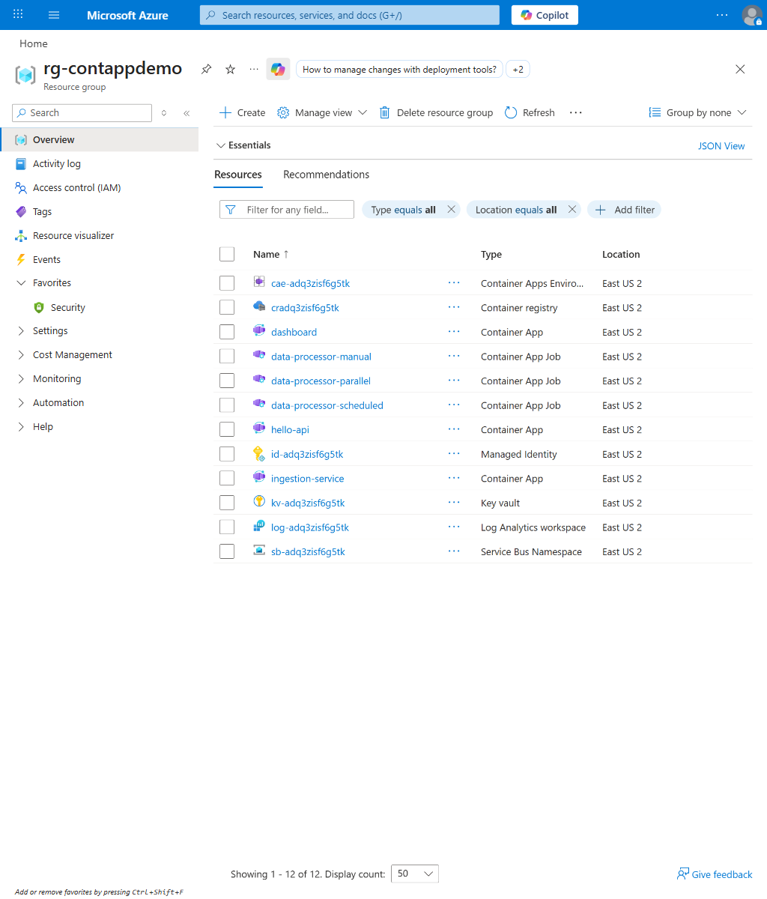
<br></br>

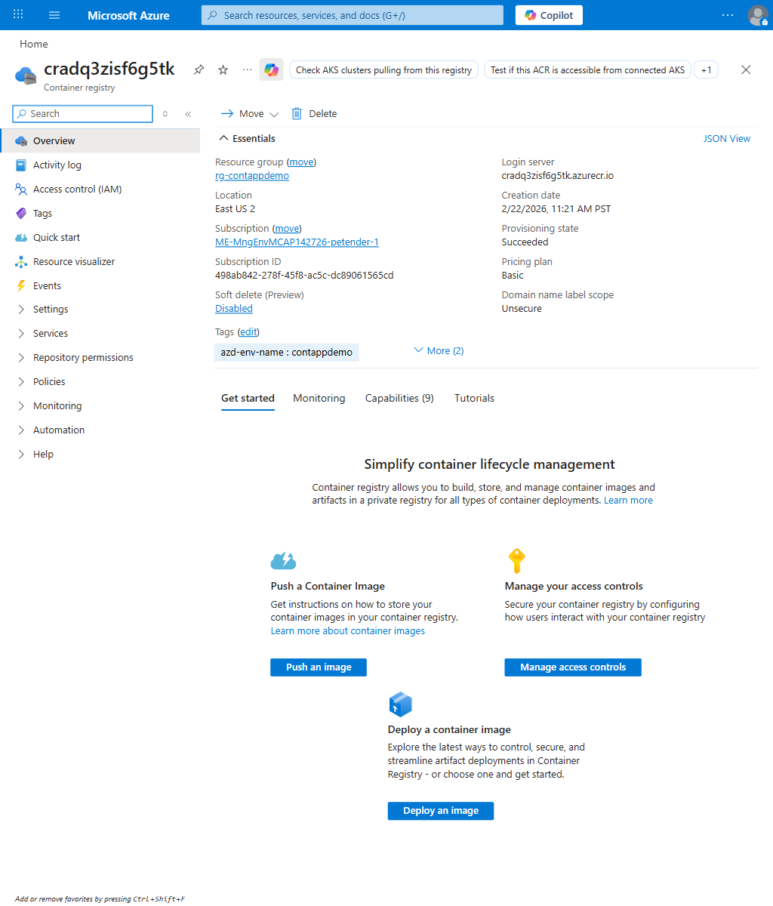
<br></br>

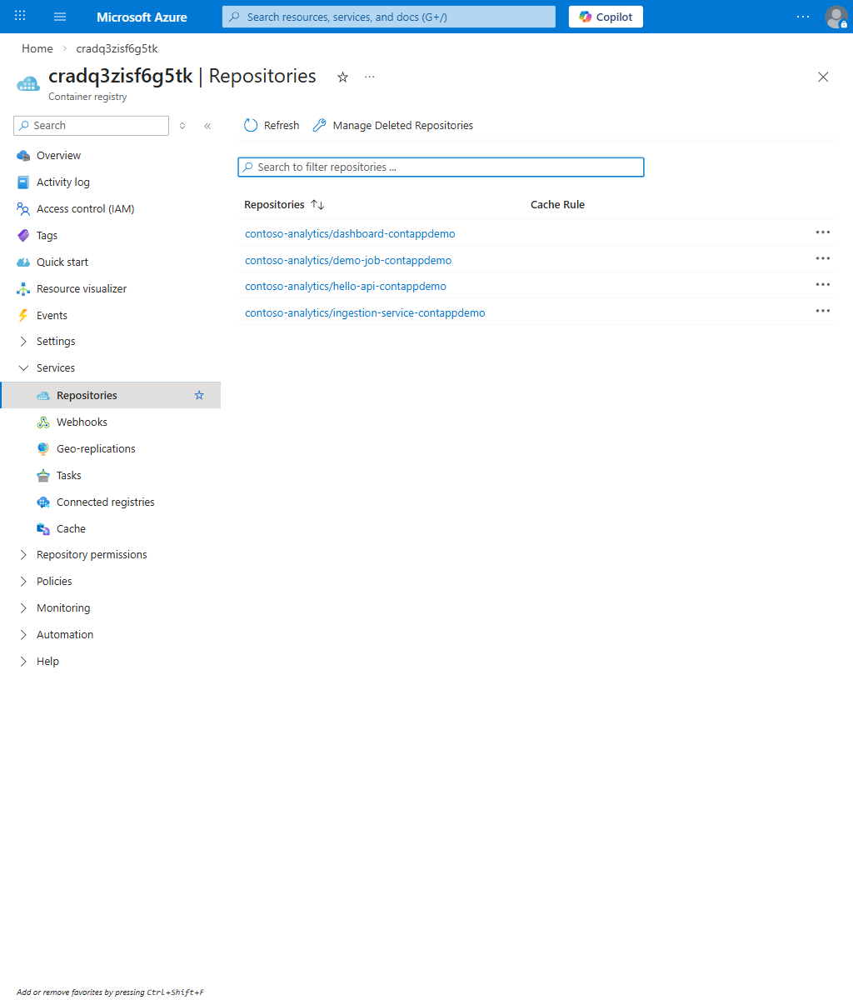
<br></br>

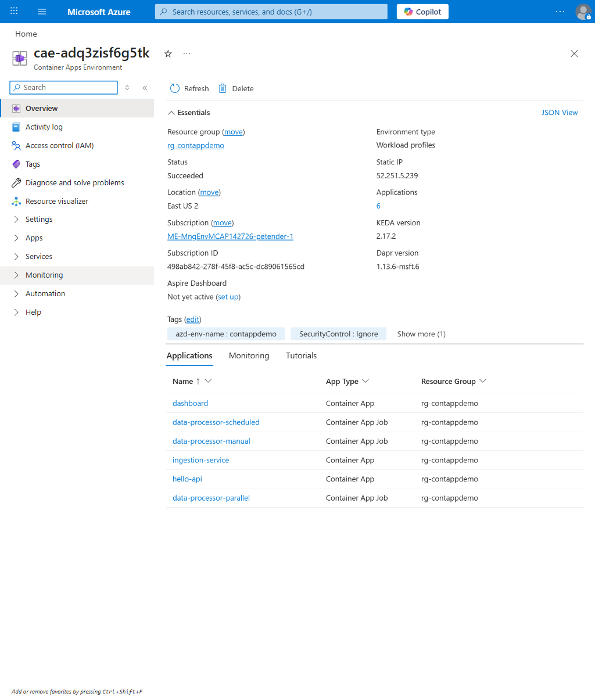
<br></br>

### 2. What can I demo from this scenario after deployment

After the deployment completes, you can run **3 independent demos** showcasing core Azure Container Apps capabilities:

---

#### Demo 1: HTTP Auto-Scaling (≈10 min)

> **Key Message:** *"Container Apps can automatically scale from 1 to 100+ replicas based on HTTP traffic — no manual configuration of KEDA or HPA required."*

1. Navigate to **ingestion-service** in the Azure Portal. Show the Container App overview, confirming it is in **Running** status.

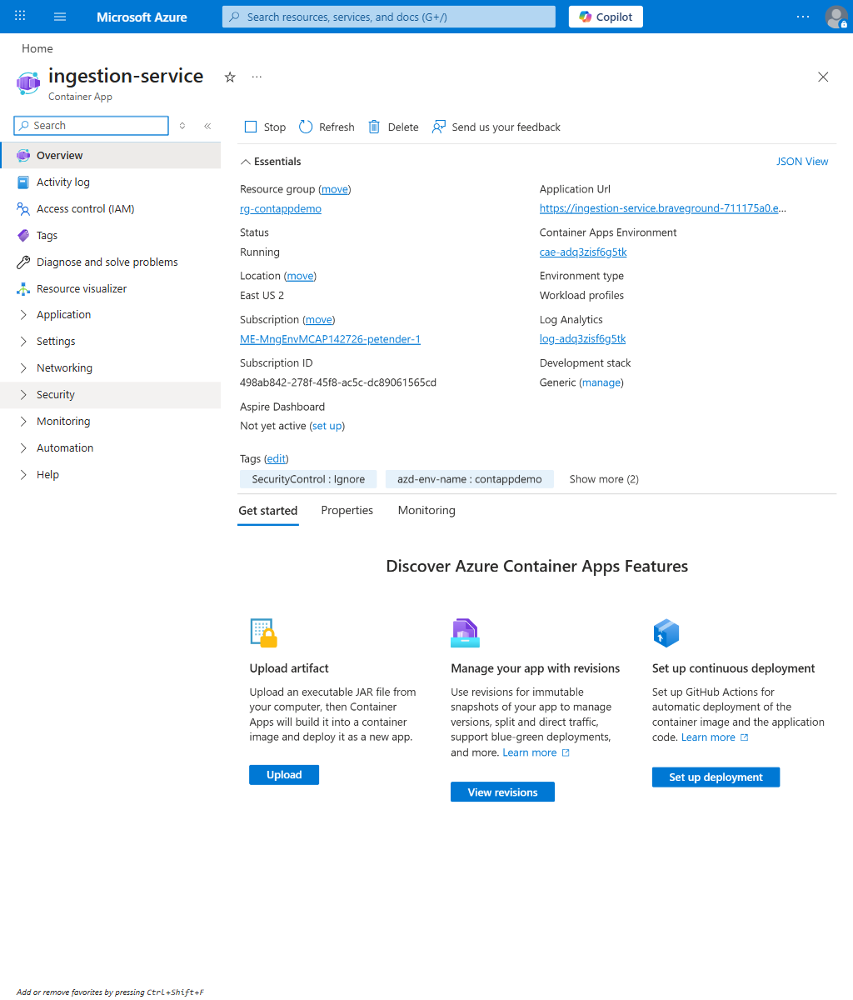
<br></br>

2. Click **Revisions and replicas** to show the current state: **1 active revision** with **1 replica** running and 100% traffic.

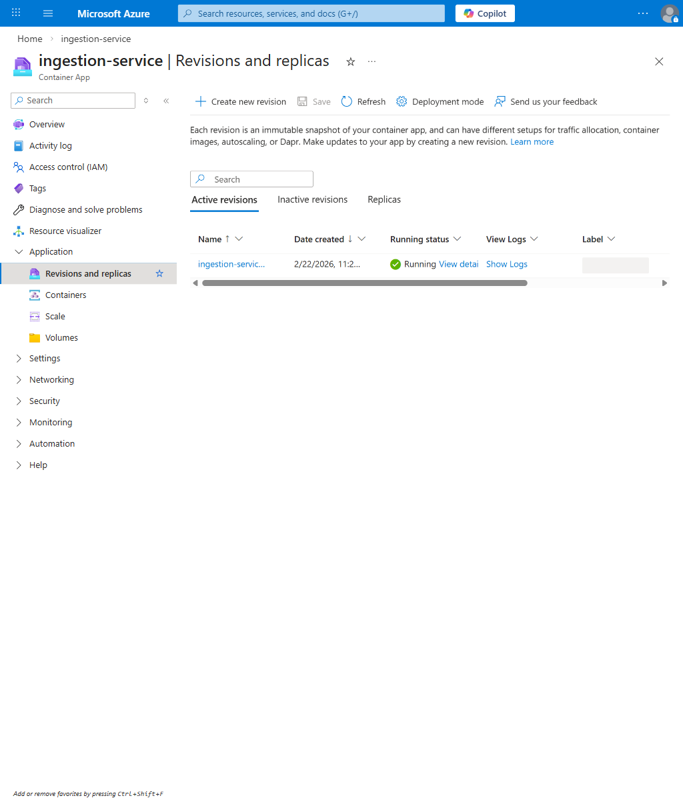
<br></br>

3. Click **Scale** to show the scaling configuration: Min replicas = 1, Max replicas = 100, with an **HTTP scaler** rule (Cooldown: 300s, Polling interval: 30s).

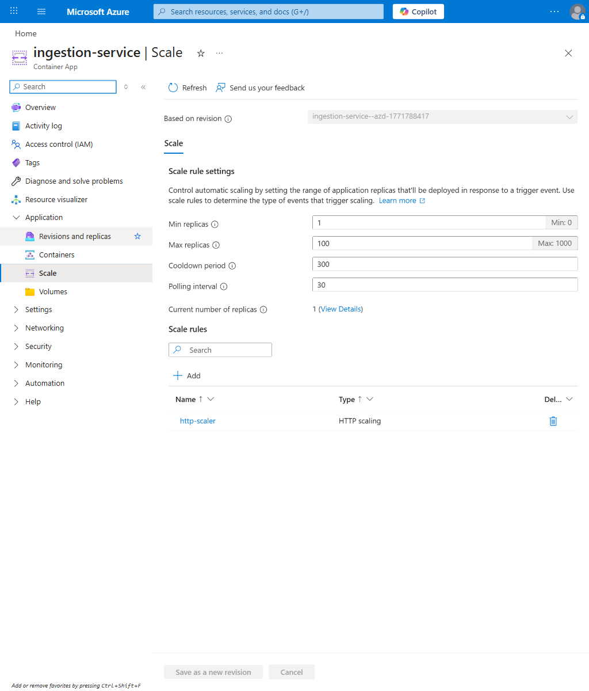
<br></br>

4. Open the **Dashboard** application URL in a new browser tab. Point out the **Contoso Analytics** interface with the "Send 100 Events" button and the live architecture diagram.

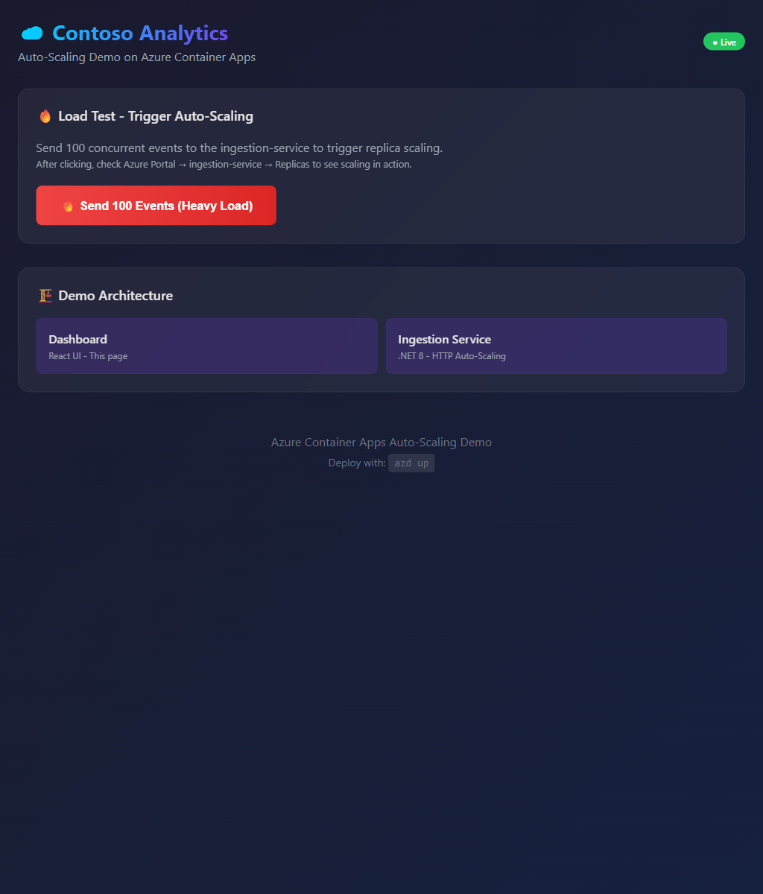
<br></br>

5. Click **"Send 100 Events"** and wait for the confirmation message: *"✅ Complete! 100 events sent."*

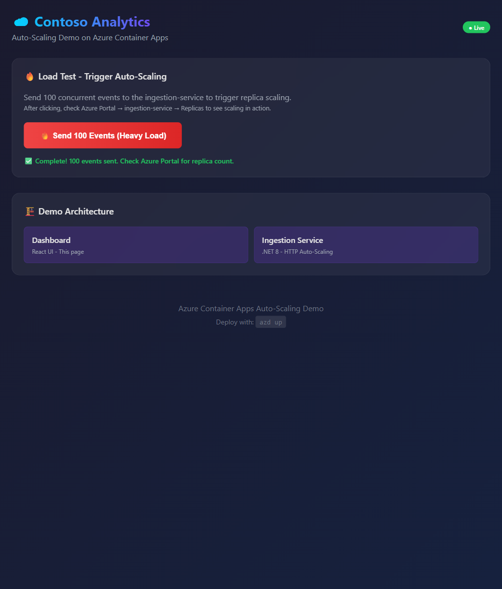
<br></br>

6. Navigate back to **ingestion-service → Revisions and replicas** in the Azure Portal. Observe the replica count has automatically scaled up (in this demo, it scaled to **15 replicas**) in response to the HTTP load.

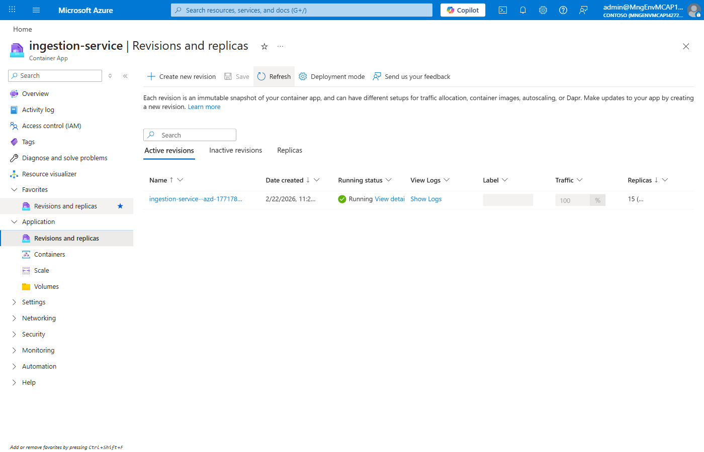
<br></br>

7. **Talking Point:** *"That's it — no KEDA installation, no HPA manifests, no Kubernetes config. Container Apps handles all the scaling infrastructure for you. After the 5-minute cooldown period, replicas will automatically scale back down to 1."*

---

#### Demo 2: Traffic Splitting with Revisions (≈8 min)

> **Key Message:** *"Container Apps supports blue-green and canary deployments out of the box using revision-based traffic splitting — no ingress controller required."*

1. Open the **hello-api** URL in a browser. Show the current version displaying a blue **"v1"** badge with the .NET 8 runtime info and hostname.

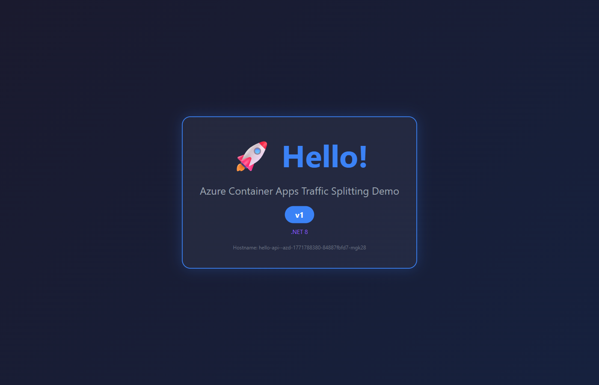
<br></br>

2. In the Azure Portal, navigate to **hello-api → Revisions and replicas**. Show the single active revision running 100% of traffic.

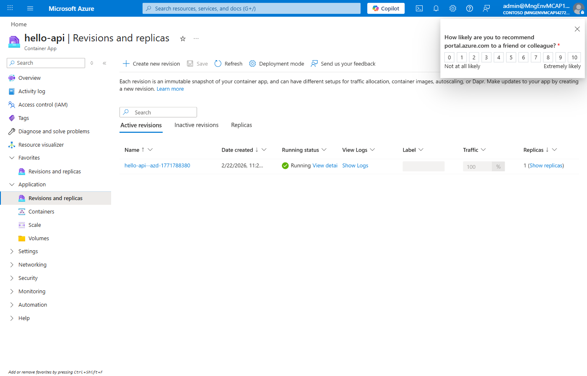
<br></br>

3. To demonstrate traffic splitting, run the following CLI commands:

```powershell
# Set variables
$rg = "<your-resource-group>"
$acr = "<your-acr>.azurecr.io"

# Enable Multiple revision mode
az containerapp revision set-mode -n hello-api -g $rg --mode Multiple

# Build and push v2 image (update v2 styling in code first)
cd src/hello-api
docker build -t "$acr/hello-api:v2" .
docker push "$acr/hello-api:v2"

# Deploy v2 as a new revision
az containerapp update -n hello-api -g $rg --image "$acr/hello-api:v2"

# List revisions to get exact names
az containerapp revision list -n hello-api -g $rg --query "[].name" -o tsv

# Split traffic 50/50 between v1 and v2
az containerapp ingress traffic set -n hello-api -g $rg `
  --revision-weight "<v1-revision>=50" "<v2-revision>=50"
```

4. Refresh the hello-api URL multiple times — you will see the response alternate between **v1** and **v2** badges, demonstrating the 50/50 traffic split.

5. Once validated, shift 100% traffic to v2:

```powershell
az containerapp ingress traffic set -n hello-api -g $rg `
  --revision-weight "<v2-revision>=100"
```

6. **Talking Point:** *"With Container Apps, canary and blue-green deployments are a single CLI command. No service mesh, no ingress controller annotations — just set the percentages."*

---

#### Demo 3: Container Apps Jobs (≈7 min)

> **Key Message:** *"Container Apps supports three types of jobs — scheduled, manual, and event-driven — all managed without Kubernetes CronJob YAML or kubectl."*

1. Navigate to **data-processor-scheduled** in the Azure Portal. Show the job overview: Trigger Type = **Schedule**, Cron expression = `*/2 * * * *` (every 2 minutes), Parallelism = 1, Completion count = 1.

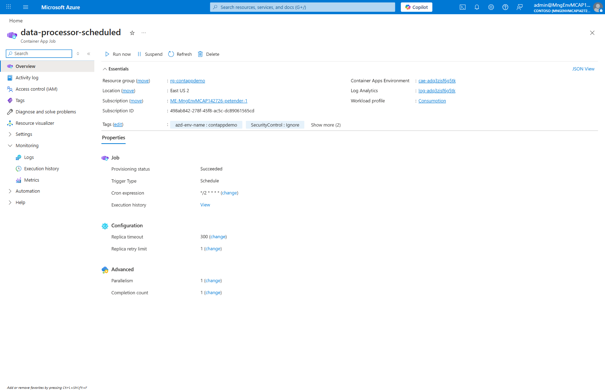
<br></br>

2. Click **Execution history** to show the automatic executions. Note the regular 2-minute intervals with **Succeeded** status and execution durations of ~27–50 seconds.

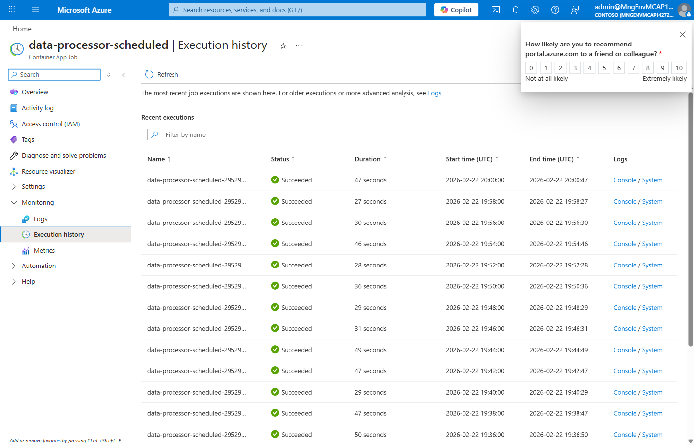
<br></br>

3. **Talking Point:** *"Scheduled jobs run automatically based on the cron expression. No CronJob YAML, no kubectl — just define the schedule in your Bicep template."*

4. Navigate to **data-processor-manual**. Show the overview: Trigger Type = **Manual**, Parallelism = 1, Completion count = 1. Trigger it via CLI:

```powershell
az containerapp job start -n data-processor-manual -g $rg
```

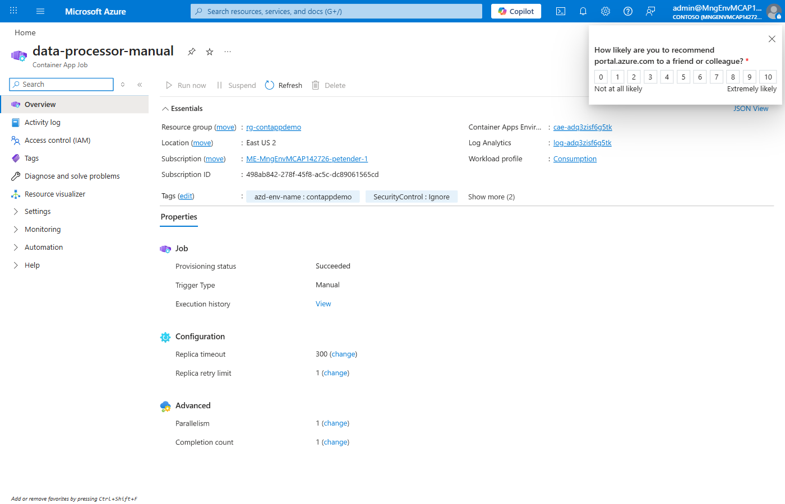
<br></br>

5. **Talking Point:** *"Manual jobs are perfect for on-demand tasks — data migrations, report generation, cleanup tasks."*

6. Navigate to **data-processor-parallel**. Show the overview: Trigger Type = **Manual**, Parallelism = **3**, Completion count = **3** — meaning 3 workers run simultaneously. Trigger it via CLI:

```powershell
az containerapp job start -n data-processor-parallel -g $rg
```

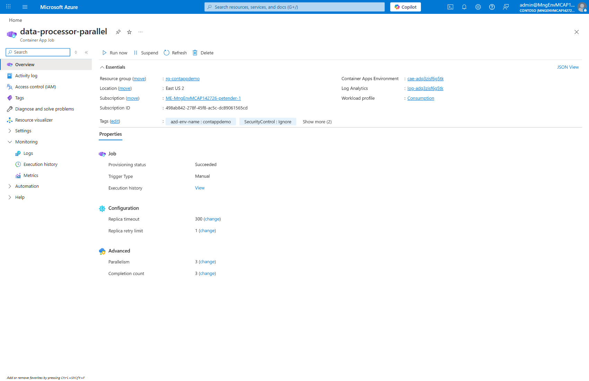
<br></br>

7. **Talking Point:** *"Parallel jobs split work across multiple instances. Great for processing large datasets quickly — each worker handles a portion."*

---

#### Demo Summary

| Feature | Container Apps | Kubernetes |
|---------|---------------|------------|
| **HTTP Scaling** | Built-in, just set threshold | Install KEDA + HPA |
| **Traffic Splitting** | Portal or CLI toggle | Ingress controller + annotations |
| **Batch Jobs** | Bicep/ARM definition | CronJob YAML + kubectl |
| **Infrastructure** | Fully managed | Cluster management required |

[comment]: <> (this is the closing section of the demo steps. Please do not change anything here to keep the layout consistant with the other demoguides.)
<br></br>
***
<div style="background: lightgray; 
            font-size: 14px; 
            color: black;
            padding: 5px; 
            border: 1px solid lightgray; 
            margin: 5px;">

**Note:** This is the end of the current demo guide instructions. After the demo, clean up all resources by running `azd down --force --purge`.
</div>


